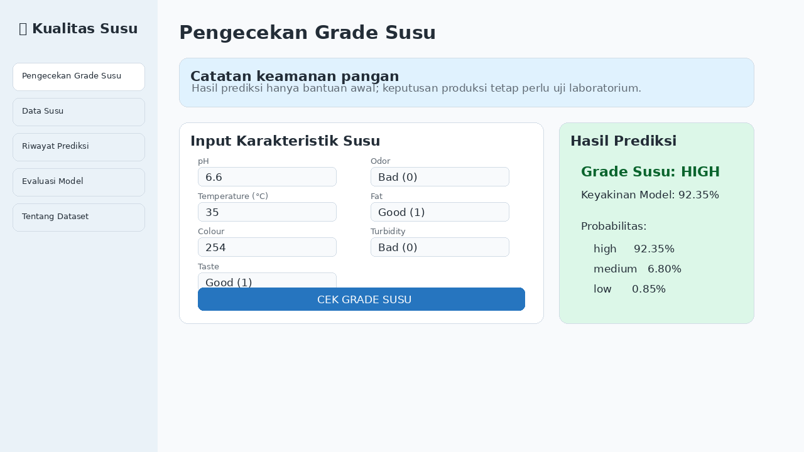
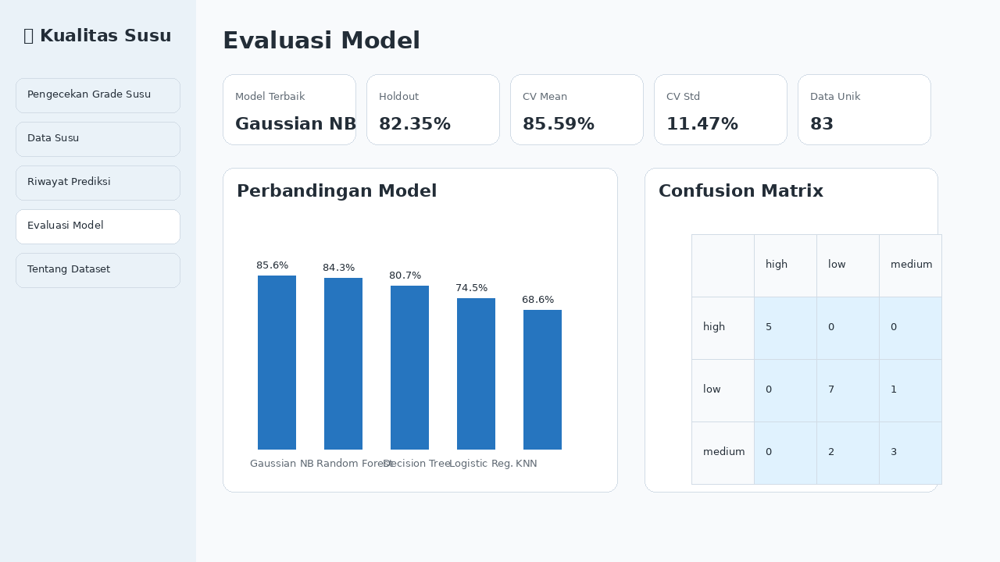
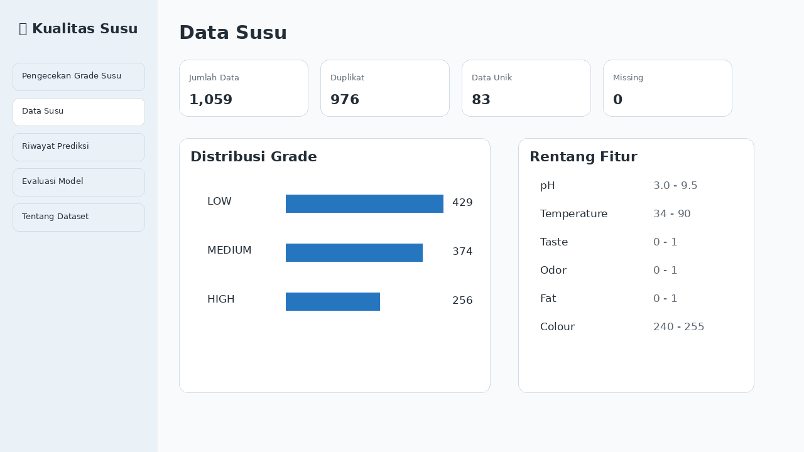

# Pengecekan Kualitas Susu

Aplikasi Streamlit untuk memprediksi **grade kualitas susu** (`high`, `medium`, `low`) berdasarkan fitur pH, suhu, rasa, bau, lemak, kekeruhan, dan warna.

Versi ini sudah dibuat lebih lengkap: evaluasi model valid, perbandingan beberapa algoritma, confidence warning, riwayat prediksi terpisah, Dockerfile, GitHub Actions, testing, model card, dan dokumentasi siap pakai.

## Preview Tampilan

| Prediksi | Evaluasi Model | Data Susu |
|---|---|---|
|  |  |  |

## Fitur Utama

- Prediksi grade susu dari input pengguna.
- Menampilkan tingkat keyakinan model dan probabilitas setiap grade.
- Peringatan jika tingkat keyakinan model rendah.
- Validasi input terhadap rentang data training.
- Rekomendasi tindakan berdasarkan hasil grade.
- Riwayat prediksi harian dalam file CSV terpisah.
- Tombol download hasil prediksi dan dataset.
- Evaluasi model menggunakan train/test split dan cross-validation.
- Perbandingan beberapa algoritma machine learning.
- Pemilihan model terbaik berdasarkan rata-rata cross-validation.
- Classification report dan confusion matrix.
- Dataset training tidak dicampur dengan hasil prediksi pengguna.
- Model, scaler, label encoder, dan metadata disimpan di folder `models/`.
- Dockerfile untuk deployment berbasis container.
- GitHub Actions untuk menjalankan test otomatis.

## Model Saat Ini

Model terbaik saat ini dipilih dari perbandingan 5 kandidat algoritma.

| Rank | Model | CV Mean | CV Std |
|---:|---|---:|---:|
| 1 | Gaussian Naive Bayes | 85.59% | 11.47% |
| 2 | Random Forest | 84.34% | 7.99% |
| 3 | Decision Tree | 80.74% | 8.20% |
| 4 | Logistic Regression | 74.49% | 7.80% |
| 5 | K-Nearest Neighbors | 68.60% | 11.59% |

Model tersimpan saat ini: **Gaussian Naive Bayes + StandardScaler**.

## Struktur Proyek

```text
Pengecekan-Kualitas-Susu/
├── .devcontainer/
│   └── devcontainer.json
├── .github/
│   ├── CODEOWNERS
│   └── workflows/
│       └── tests.yml
├── .streamlit/
│   └── config.toml
├── assets/
│   ├── screenshot-data.png
│   ├── screenshot-evaluasi.png
│   └── screenshot-prediksi.png
├── data/
│   ├── milkdata.csv
│   └── prediksi/
│       └── .gitkeep
├── models/
│   ├── label_encoder.pkl
│   ├── metadata.json
│   ├── milk_grade_model.pkl
│   ├── milk_grade_pipeline.pkl
│   └── scaler.pkl
├── scripts/
│   └── train_model.py
├── src/
│   └── milk_quality/
│       ├── __init__.py
│       ├── config.py
│       ├── data.py
│       ├── model.py
│       └── storage.py
├── tests/
│   ├── test_data_quality.py
│   └── test_model_training.py
├── .dockerignore
├── .gitignore
├── Dockerfile
├── LICENSE
├── MODEL_CARD.md
├── README.md
├── app.py
├── kualitas_susu.py
├── requirements.txt
└── requirements-dev.txt
```

## Cara Menjalankan Lokal

1. Ekstrak file ZIP.
2. Masuk ke folder proyek.
3. Buat virtual environment jika diperlukan.
4. Install dependency aplikasi:

```bash
pip install -r requirements.txt
```

5. Jalankan aplikasi:

```bash
streamlit run kualitas_susu.py
```

Atau gunakan entry point alternatif:

```bash
streamlit run app.py
```

## Cara Menjalankan dengan Docker

Build image:

```bash
docker build -t pengecekan-kualitas-susu .
```

Jalankan container:

```bash
docker run --rm -p 8501:8501 pengecekan-kualitas-susu
```

Buka aplikasi di browser pada port `8501`.

## Cara Training Ulang Model

Model sudah tersedia di folder `models/`. Jika dataset diperbarui, jalankan:

```bash
python scripts/train_model.py
```

Script tersebut akan:

- membersihkan data duplikat,
- membandingkan beberapa model,
- memilih model terbaik berdasarkan cross-validation,
- melatih model final,
- memperbarui file model di folder `models/`,
- memperbarui `models/metadata.json`.

## Cara Menjalankan Test

Install dependency development:

```bash
pip install -r requirements-dev.txt
```

Jalankan test:

```bash
pytest
```

Test juga akan otomatis berjalan di GitHub Actions melalui file:

```text
.github/workflows/tests.yml
```

## Evaluasi Model

Evaluasi dilakukan dengan cara yang lebih valid:

- Data duplikat dihapus sebelum training/evaluasi.
- Data dibagi menjadi training dan testing menggunakan stratified split.
- Skor tambahan dihitung dengan stratified cross-validation.
- Classification report membandingkan `y_test` dengan `y_pred`.
- Confusion matrix ditampilkan di aplikasi.
- Beberapa algoritma dibandingkan sebelum model final disimpan.

## Penjelasan Fitur Dataset

| Fitur | Keterangan |
|---|---|
| `pH` | Tingkat keasaman susu |
| `Temperature` | Suhu susu dalam derajat Celsius |
| `Taste` | 0 = buruk, 1 = baik |
| `Odor` | 0 = buruk, 1 = baik |
| `Fat` | 0 = buruk, 1 = baik |
| `Turbidity` | 0 = buruk, 1 = baik |
| `Colour` | Nilai warna susu |
| `Grade` | Label kualitas susu: high, medium, low |

## Riwayat Prediksi

Hasil prediksi pengguna disimpan di folder:

```text
data/prediksi/
```

File riwayat prediksi **tidak** dimasukkan kembali ke `data/milkdata.csv` secara otomatis. Hal ini disengaja agar dataset training tidak tercampur dengan hasil prediksi model sendiri.

## Model Card

Detail model, metrik, kandidat algoritma, batasan, dan catatan keamanan tersedia di:

```text
MODEL_CARD.md
```

## Catatan Penting

Hasil prediksi aplikasi ini hanya sebagai bantuan awal. Untuk keputusan konsumsi, produksi, distribusi, atau keamanan pangan, tetap diperlukan pemeriksaan laboratorium dan standar operasional yang berlaku.
